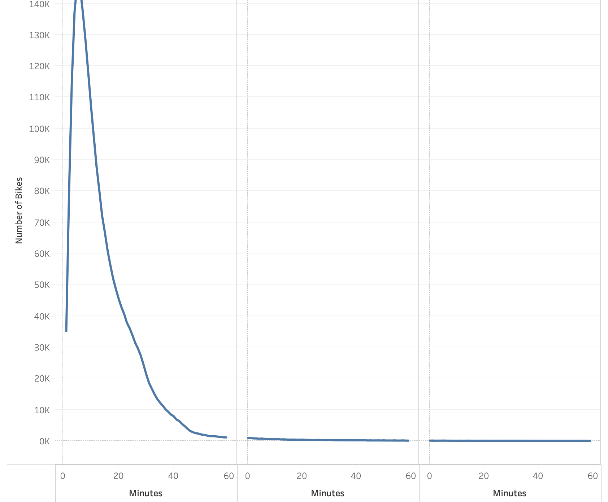
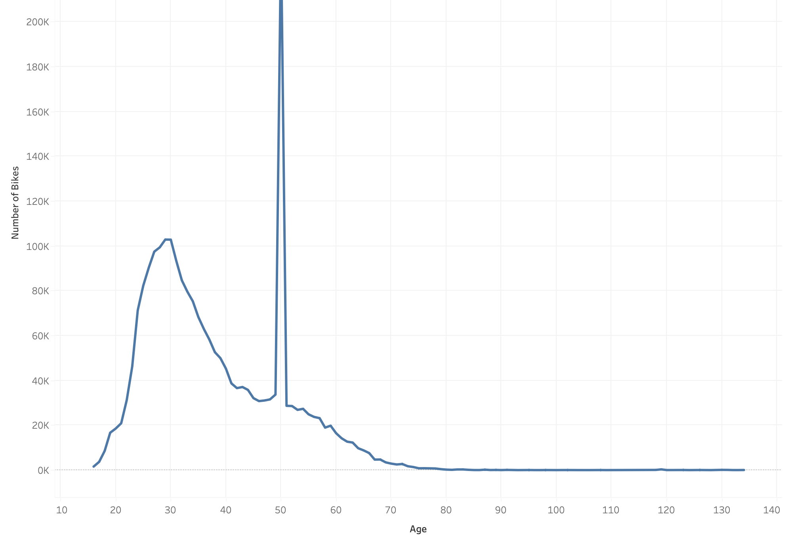
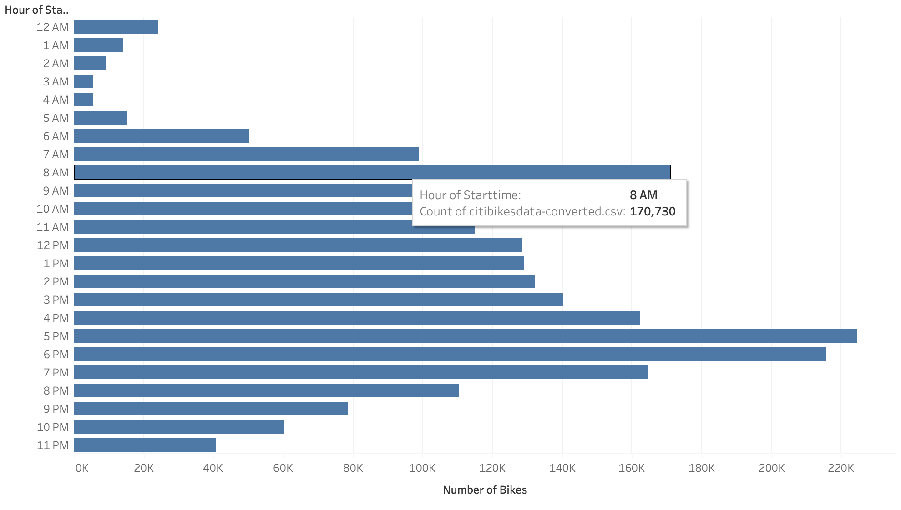
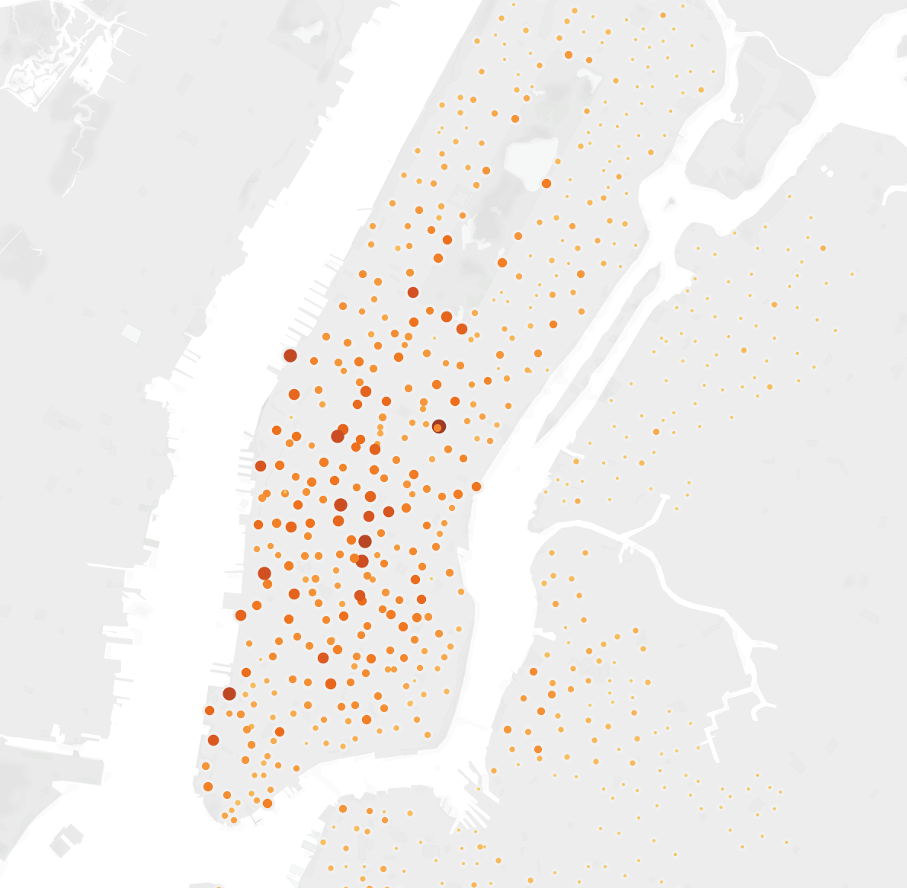
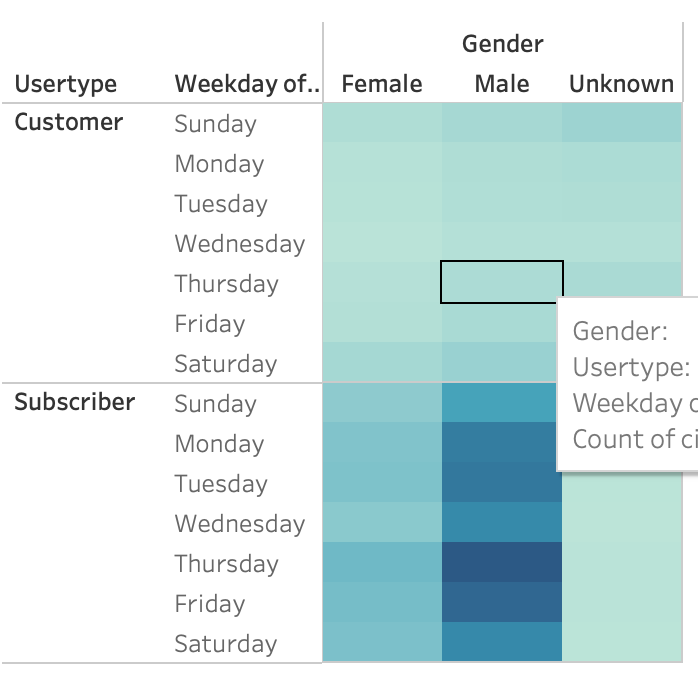
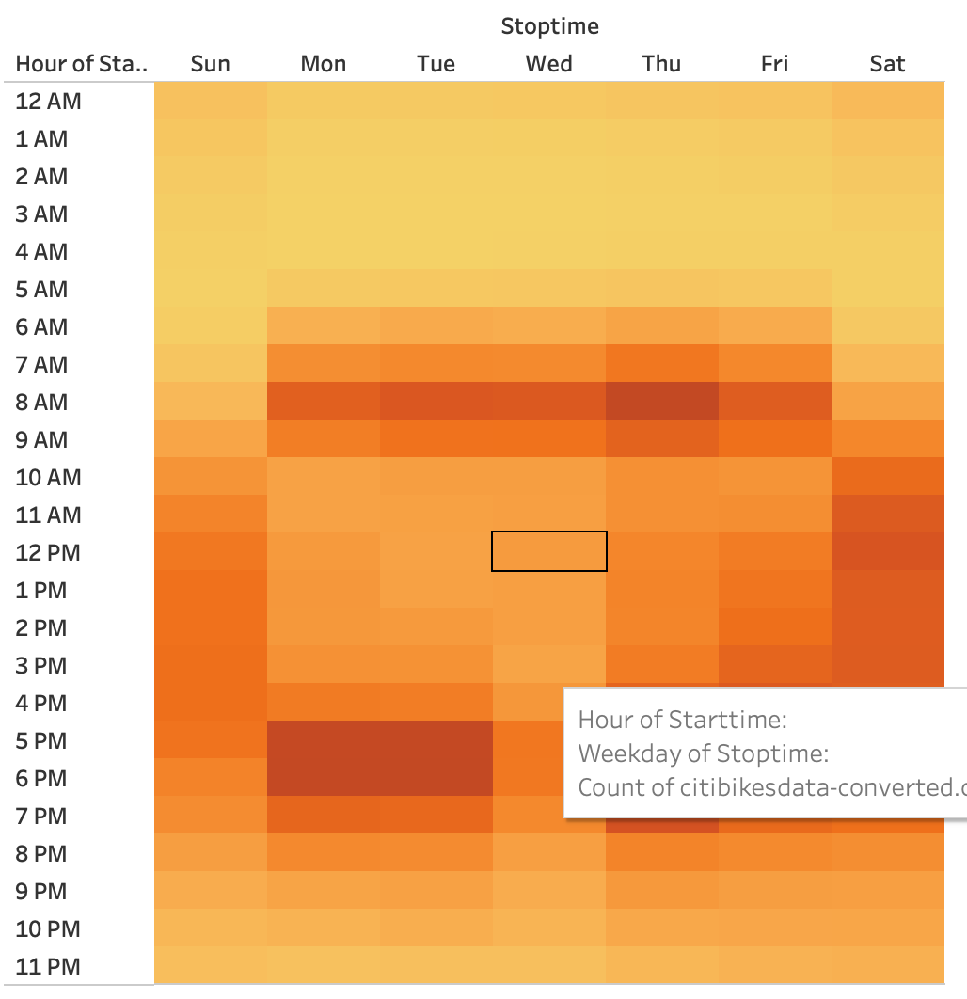
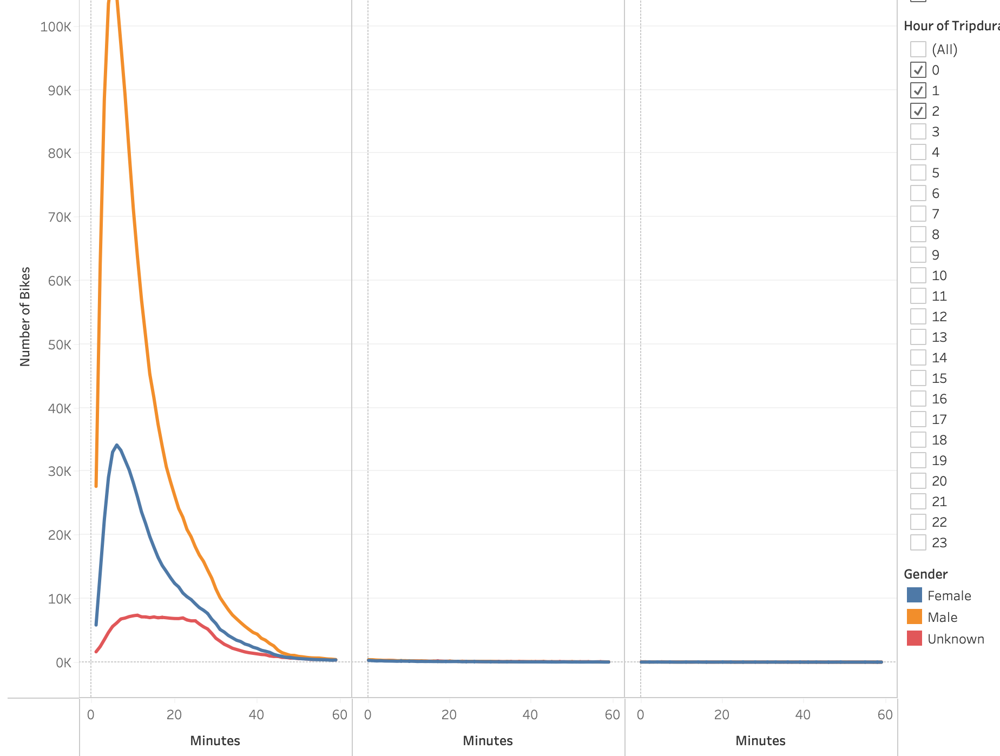

# BikeSharing

[link to dashboard](https://public.tableau.com/app/profile/carter.verbrugge/viz/CitiBikeAnalysis_16758095915520/Story1?publish=yes)

## Overview
The purpose of this analysis was to evaluate bikesharing data from CitiBike in New York to determine how a similar business might work in Des Moines, Iowa. In this module, we looked at things like number of trips, proportion of short term customers to annual subscribers, peak riding hours, rides by gender, location, age, and more. 

## Results

This first visualization tells us that in New York, rides never last longer than one hour and very rarely last longer than 20 minutes. This may not be the case for Des Moines but at least it gives us a general idea of what to expect in terms of trip duration for a bike sharing business.

This second visualization is an interesting one. It seems to be telling us that, in New York, CitiBike's strongest customer base is 50 year olds. However, this irregular spike in number of bikes rented right at the age of 50 seems to be a mistake and is probably not a good representation of the actual data. If we ignore this outlier, it becomes clear that 25-35 year olds use CitiBikes' services more than any other age group.

This visualization shows us that the most popular times to rent a bike are in the morning and in the evening. Specifically 8am, 5pm, and 6pm. This makes sense considering people are going to and from work around these hours. It is very probable that this would be the case in Des Moines as well assuming Des Moines customers would be using the service for similar purposes.

This visualization demonstrates where customers pick their rental bikes up most often. It is not particularly helpful for us as we consider starting a business in Des Moines but it would be very helpful for those working for CitiBikes in New York.

This heat map clearly shows us that CitiBikes' subscribers rent bikes from the company much more than regular customers. This tells us that gaining a strong subscriber base will be essential for the success of the business. The map also tells us that men rent bikes far more than women and that customers rent bikes on weekdays much more than weekends. This might mean that we should consider males to be our target market but it might also mean that we are missing out on a huge part of the market (females) and should find new ways to reach that market. Plus, we can assume that, at least in New York, people use CitiBikes to travel to and from work more than for any other purpose because of the fact that they are used most often on weekends.

This heat map confirms that customers usually use CitiBikes to travel to and from work during the week. However, it also tells us that during the weekend, customers tend to rent bikes in the middle of the day rather than in the morning and evening as they do during the week.

This chart once again demonstrates that the average trip duration is somewhere around 20 minutes and that men are much heavier users of CitiBikes' services than women.

## Summary 
